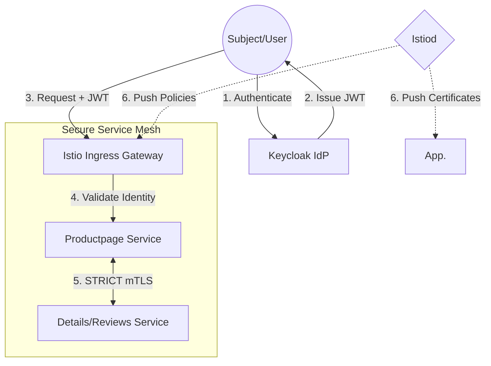

## 🏗️ System Architecture
The system is stratified into three functional tiers to ensure separation of concerns and high-availability persistence:

1.  **Identity Layer (IdP):** Powered by **Keycloak**, serving as the centralized "Root of Trust" (OIDC/JWT).
2.  **Control Plane:** Orchestrated by **istiod**, managing certificate issuance (CA) and policy distribution.
3.  **Data Plane:** Distributed **Envoy Sidecar Proxies** acting as Policy Enforcement Points (PEP).

🛡️ Key Security Implementations

1. Identity-Aware Access Control (Layer 7)

  - Default Deny Posture: All unauthenticated traffic is authoritatively blocked
    (HTTP 403 Forbidden).
  - JWT Validation: Localized validation of asymmetric digital signatures
    (RS256) at the edge PEP.

2. Micro-segmentation (Layer 4)

  - STRICT mTLS: Enforced Mutual TLS for 100% of internal "East-West" traffic.
  - Cryptographic Isolation: Every workload is assigned a unique SPIFFE ID,
    preventing internal sniffing.

3. Resilience & Attack Mitigation

  - Anti-DDoS: Configured Envoy Filters for Local Rate Limiting (Token Bucket
    Algorithm) returning HTTP 429.
  - Brute Force Defense: Adaptive account lockout policies at the Identity
    Provider.
  - Policy-as-Code (OPA): Using Gatekeeper to prevent insecure infrastructure
    configurations (e.g., Privileged/Root containers).

📊 Empirical Evidence (Research Results)

Verification of Identity Access (403 vs 200 OK)

Auth Verification The cluster successfully rejects anonymous probing while
opening gates for verified JWT principals.

Traffic Encryption Audit (Kiali Graph)

mTLS Padlocks 100% mTLS coverage evidenced by padlock icons on every internal
communication edge.

Infrastructure Integrity (Gatekeeper Rejection)

OPA Denial Programmatic rejection of unsafe Pod manifests by the Admission
Controller.

⚙️ Setup & Reproduction

Prerequisites

  - Ubuntu 24.04 LTS (WSL2)
  - Docker Engine & Minikube
  - Istio, Helm, and jq

Quick Start

1.  Initialize Infrastructure:
    minikube start -p zt-lab --cpus 4 --memory 6144 --driver=docker
2.  Deploy Service Mesh:
    istioctl install --set profile=demo -y
    kubectl label namespace default istio-injection=enabled
3.  Apply Zero Trust Policies:
    kubectl apply -f manifests/istio/
    kubectl apply -f manifests/opa/

🧠 Lessons Learned

  - Issuer Synchronization: Successfully addressed the "Issuer Mismatch" issue
    in dynamic port-mapped WSL2 environments.
  - Stateful Resilience: Integrated Kubernetes PVCs to ensure the Identity Root
    of Trust survives system restarts.
  - Resource Optimization: Efficiently managed sidecar overhead to run a complex
    ZTA on consumer-grade hardware.

📜 References

  - [1] NIST Special Publication 800-207: Zero Trust Architecture.
  - [2] CISA: Zero Trust Maturity Model Version 2.0.
  - [3] Istio, Keycloak, and OPA Official Documentation.

Maintained by [Tong Trung An]
Cloud Security Researcher | DevSecOps Student

---

